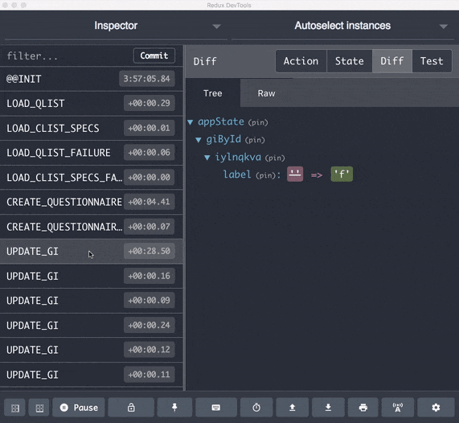

# Debugging

## Redux DevTools

Redux provides some useful tools for debugging. Pogues is [configured](https://github.com/InseeFr/Pogues/blob/d28a7f67894479807f6b3d1c45b1b24883a556c4/src/js/store/configure-store.js#L17) to work with the Redux DevTools extension. It means that if you're using Chrome or Firefox, you can install this [extension](https://github.com/zalmoxisus/redux-devtools-extension) to inspect the application state and help you debug the application.

## React DevTools

With [React DevTools](https://github.com/facebook/react-devtools), you can inspect your page, discover the component hierarchy, find which React component corresponds to some piece of UI and see what props a component is passed.

## Tips and tricks

If you're debugging with Chrome, these two options can be useful.

Since the code is compiled, one line in the original file can sometimes be transformed into multiple lines in the bundle. It can be difficult in this situation to find out exactly what went wrong when an error occurred. You can tempararily desactivate source maps in the dev tools settings and reload the page to see more precisely the origin of the issue.

You can set on the "Pause on exceptions" option to break when an error occurs. The "Pause on caught exceptions" option can also be useful, for instance to break on an exception happening within a Promise.

