# User guide for Pogues

Last release 2020/07/02

---

# The main principles of Pogues
Questionnaire design tool for metadata-driven collection

- Integrated into the RMéS-Coltrane information system
	- Using RMéS (Stastical Metadata Repository used by Insee) metadata
	- Producing survey questionnaires (Coltrane) thanks to a questionnaire generator called Eno
- Target population : survey designer
- Focus : design questionnaires in a full WYSIWYG way

---
# Pogues, functional architecture

---

# Connection to the application

- with your web browser, enter :
http://conception-questionnaires.insee.fr

- enter your login and validate by clicking on "OK"

---

# Advice for entry
In order to avoid embedding special characters that could sometimes compromise the proper functioning of the application, we strongly recommend using an intermediary like Notepad++ (encoding in UTF8) or Notepad to copy/paste between your original question list and Pogues

---

# Creation of a new questionnaire

Click on the button "New Questionnaire"
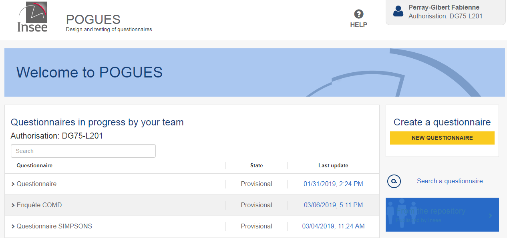

---

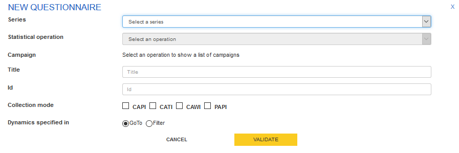

Select for your questionnaire :
- a series :
	- for example : Enquête trimestrielle de conjoncture dans l'artisanat du bâtiment
- a statisticial operation:
	- for example : Enquête trimestrielle de conjoncture dans l'artisanat du bâtiment 2018
- the involved campaigns :
	- for example : july and december 2018
---

Fill in :

- a title
- an id 
	- like a short label, by default, Pogues proposes to pre-fill it whith the first characters of the title
- one or more collection modes (not completely working now)
 	- CAPI (face to face), CATI (phone), CAWI (Internet), PAPI (paper) 

- Validate all with the "Validate" button.

---

# Input of the questionnaire metadata

To start, an error message warns you your questionnaire must contain at least one sequence and one question.

---

# Creation of a sequence (1)

A sequence is a part or a module of a questionnaire. It corresponds to a dedicated display style (see display example) and delimits a web page of the questionnaire. All questions in the same sequence will appear of the same web page. If the questionnaire has got 2 sequences, it will be composed of 2 web pages, one for the first sequence and the other for the second one.

---

# Creation of a sequence (2)
Click on the +Sequence button at the bottom of the Pogues page

---

Fill in :
- a label 
- an id
    - like a short label, by default, Pogues proposes to pre-fill it whith the first characters of the title
- modify collection modes if this sequence doesn't concern every collection mode defined for the questionnaire
- If necessary, fill in a Statement (see Creation of a statement)
- If necessary, fill in a Control (see Creation of a control)
- Validate with the dedicated button

---

# Creation of a sub-sequence

A sub-sequence is a part of a sequence, therefore a sub-module of a questionnaire. A questionnaire contains one or more sequences, each of them can contain 0 or several sub-sequences. A sub-sequence corresponds to a dedicated display style (see display example) but contrary to a sequence, it hasn't got consequences on the number of questionnaire web pages. A sub-sequence corresponds to a part of a web page with a title of sub-sequence, which gathers questions related to the same theme.

---

- Click on the +Sub-Sequence button at the bottom of the Pogues page

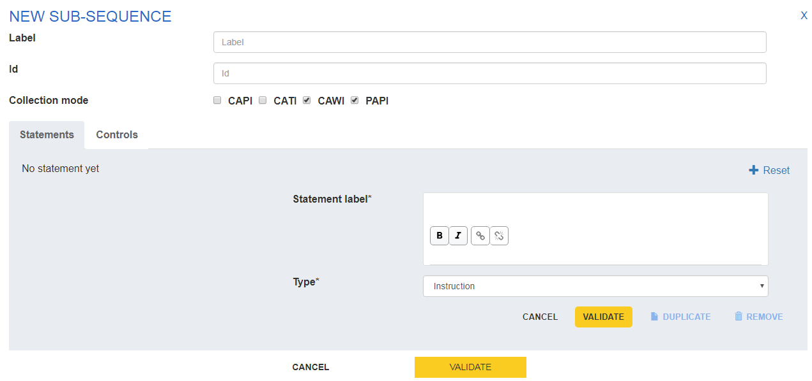

---

Fill in :
- a label 
- an id
    - like a short label, by default, Pogues proposes to pre-fill it whith the first characters of the title
- modify collection modes if this sub-sequence doesn't concern every collection mode defined for the questionnaire
- If necessary, fill in a Statement (see Creation of a statement)
- If necessary, fill in a Control (see Creation of a control)
- Validate with the dedicated button
    
---

# Web display example of a sequence, sub-sequence, question

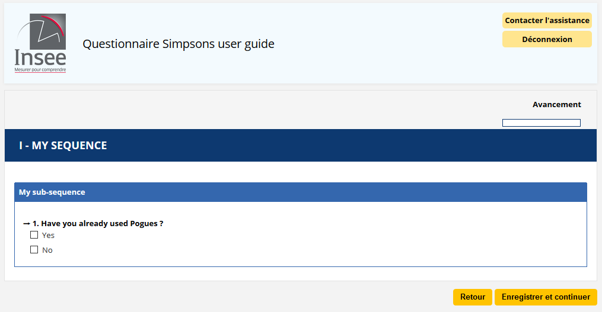

---

# Creation of a question

Click on the button +Question

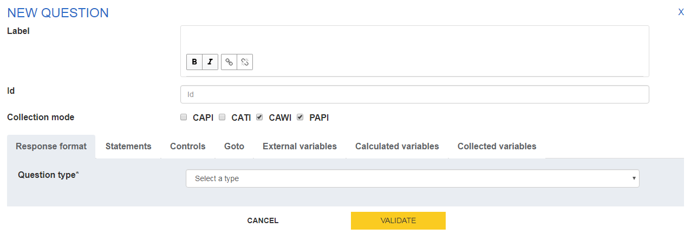

---

-Fill in :
- a label 
- an id
    - like a short label, by default, Pogues proposes to pre-fill it whith the first characters of the title
- modify collection modes if this question doesn't concern every collection mode defined for the questionnaire
- a question type
	- Simple response (text, date, number, boolean or duration), single choice response, multiple choice response, table
- Validate with the dedicated button		
---

# Creation of a simple response question

Examples :

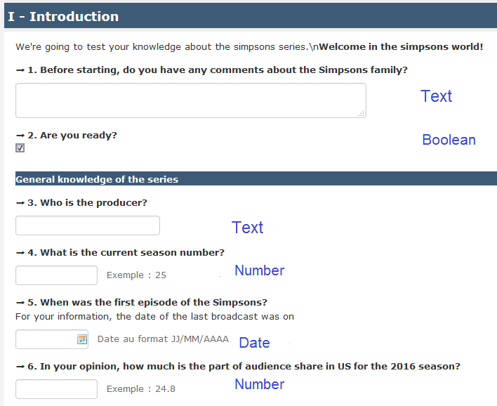

---

# Creation of a simple response question

Examples :

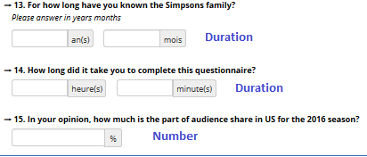

---
For a simple response question, fill in : (1)
- if mandatory or not : tickable, untickable. Only saved as an information for now. No effect on the display of the questionnaire.
- a response type :
	- Text, Date, Number, Boolean, Duration
- if response type=Text, fill in a length (maximum number of characters), if necessary a pattern (not working now, useful soon to specify regular expressions like emails, phone numbers, etc.)
- if response type=Date, fill in a format among YYYY-MM-DD, YYYY-MM, YYYY as well as a possible minimum and/or maximum (by default set to the equivalent of 1900-01-01 for the minimum and to the equivalent of the current date for the maximum).
 
		
---

For a simple response question, fill in : (2)
- if response type=Number, fill in a minimum and a maximum value, a precision (number of decimals, by default none), if necessary an unit measurement (now among : €, k€, %, hours, months, days and years)
    
- if response type=Boolean, nothing to fill in and it corresponds to a unique checkbox tickable/untickable.
- if response type=Duration, fill in the output format among hours-minutes, years-months or hours-hundredths as well as a possible minimum and/or maximum (by default respectively configured at 0 hours 0 minutes and 99 hours 59 minutes, 0 years 0 months and 99 years 11 months, 00:00 and 99:99).
    
- Validate

---

# Creation of a single choice response question

Examples :

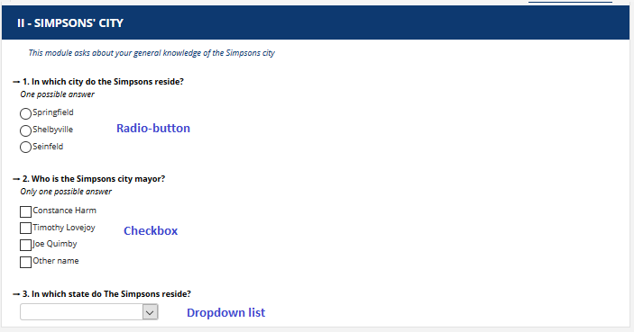

---

For a single choice response question, fill in : (1)
- if mandatory or not : tickable, untickable. Only saved as an information for now. No effect on the display of the questionnaire.
- Visualization Hint :
	- Checkbox (each modality is tickable/untickable, but only one response possible)
	- Radio-button (web standard ergonomy for this type of response, if a modality is ticked, impossible to untick all modalities later (respondent can modify his answer, but can't delete it))
	- Dropdown (only when the list of modalities is long and well-known by respondent (example : Countries, Country Area)), this response type will be transformed into a free text field on the paper questionnaire

		
---

For a single choice response question, fill in : (2)
-   Specify the code list with :
    -   Create a list. In this case :
    	-   Give a significant name to the New code list and fill in for each response modality, a code and a label, progressively with the "Add" button.
    -   Retrieve in the repository (not working now)  : will soon propose the code lists previously created for all questionnaires published in RMéS from Pogues. Will be particularly useful for long code lists (countries, nomenclatures, etc.).
    -   Retrieve in the questionnaire : proposes the code lists previously created for the questionnaire
- Validate
  		
---

# Creation of a multiple choice response question

Examples :

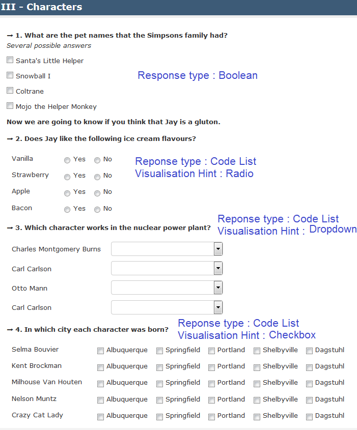

---

For a multiple choice response question, fill in : (1)
-   Specify the code list with :
    -   Create a list. In this case :
    	-   Give a significant name to the New code list and fill in for each response modality, a code and a label, progressively with the "Add" button.
    -   Retrieve in the repository (not working now)  : will soon propose the code lists previously created for all questionnaires published in RMéS from Pogues. Will be particularly useful for long code lists (countries, nomenclatures, etc.).
    -   Retrieve in the questionnaire : proposes the code lists previously created for the questionnaire
    
  		
---

For a multiple choice response question, fill in : (2)

- Response type :
	- Code list or boolean
		- if Code list, specify the code list with :
    			- Create a liste
    			- Retrieve in the repository (not working now) 
    			- Retrieve in the questionnare
    	- if Code list, select the visualization hint :
            	- Checkbox
    			- Radio
    			- Dropdown		

- Validate
      
---        
  
# Creation of a table (Primary information axis : Code list)

Exemple 1 :

---

Exemple 2 :

---

Exemple 3 :

---
For a fixed table (with line headers in first column, no possibility to add new lines), fill in:
- Primary information axis :
	- choose code list :
		- specify the code list as usual
- Secondary information axis:
    - if ticked :
    	- specify the code list as usual
- Measure information (only one if a secondary information axis, else one or more with the + button)
    - fill in a simple response or a single choice response     	
- Validate
  		
  		
---

# Creation of a table (Primary information axis : list)

For a dynamic table (without line headers in first column, possibility to add new lines), fill in:
- Primary information axis :
	- please specify :
		- number of lines minimum
		- number of lines maximum (limited to 300)
- Measure information (one or more with the + button)
    - fill in a simple response or a single choice response     	
- Validate

---
# Creation of a text complement to specify the choice of an "Other" type modality
It is possible to specify by a textual complement the tick of a modality of type "Other" for a question calling for a single choice or multiple choice answer or for a column of a fixed size table calling for a single choice answer.

To do this, click on "see in detail" for the question concerned in Pogues then click on the + icon of the modality for which you want to trigger this text complement, modify if necessary the length (by default 249 characters) and the wording of the field (by default "Specify :").

- Validate 

---

 ---

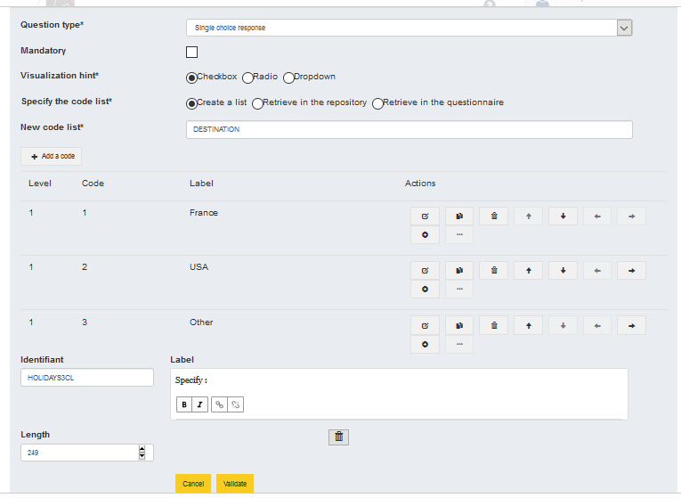

It is also possible to modify or delete these text additions.

---

# For every created question, you need to generate collected variables

go to "collected variables" tab to generate them
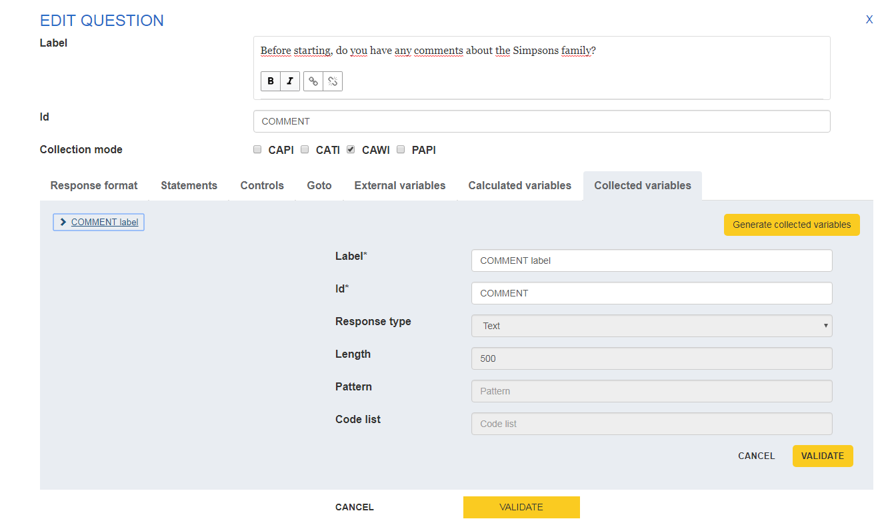
 		
---
- Click on the button "Generate collected variables" and modify label proposed by default by pogues with a significant label (think about your successors) and, if necessary, modify id
- **If some cells in a table are not to be collected because they are not applicable or are intended, for example, to recall a calculated, collected or hard total (for example 100%), uncheck for each cell concerned the Collected boolean associated with the variable collected ad hoc.**

- As your changes are made, click on "Validate" displayed at the bottom right of the grey area

- At the end, click on "Validate" in the middle a little lower down to validate all your modifications

---

# How to manage a Code list (1)

---
# How to manage a Code list (2)
You can do the following actions
1. modify one modality : first 2 buttons, up to you, the first one will display the modification screen, the second button will display modality before modification and the modification screen
2. delete one modality
3. move the modality in the code list : go up or down in the list
4. manage a hierarchy between modalities : go up or down in the hierarchy
---

# Creation of a statement (1)

In the "Statements", fill in : 
- a label
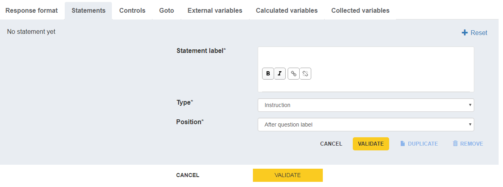

---

# Creation of a statement (2)

- a type among :
	- Instruction
    - Comment
    - Help
    - Warning
NB : there is no difference now depending on the type of the statement, therefore no difference for the respondent. But, as the information is precisely saved in the DDI file, statements could be one day displayed differently, depending on their type (it is not expected now). We advice therefore to choose the type which seems to you the closest to the statement type, without refining however.

---

# Creation of a statement (3)

- Position : before or after question label
- Validate
        
NB : you can also delete or duplicate a statement

---

# Creation of a tooltip (1)
Within a label, select the text corresponding to the tooltip and click on the button (surrounded in red in the screenshot below)

---

# Creation of a tooltip (2)

Fill in the text you want to display in the tooltip and validate by clicking on the button surrounded in red in the screenshot below or click on the cross to delete and don't forget to Validate at the end 

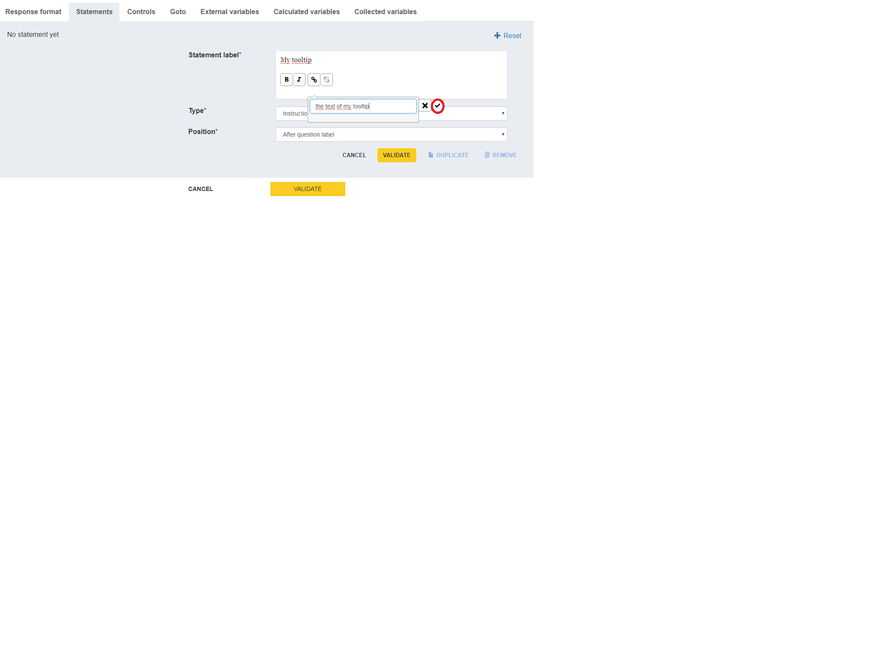

---

# Deletion of a tooltip
Select the text corresponding to the tooltip and click on the button sourrounded in red in the screenshot attached and don't forget to Validate at the end 
NB : impossible to modify a tooltip but you can delete it and recreate (and then modify) it 

---

# Creation of a control (1)

A control verifies the quality of the information entered in a questionnaire. We can also talk about internal consistency checks on the questionnaire. This may include consistency with previous data.

On the web visualization side of the questionnaire (Eno application), a control is triggered when :
    - the condition is true;
    - AND I have passed and left a field affected by the conditions (or I have clicked on next). 

---

# Creation of a control (2)

You can create a control in the "Controls" tab of the question on which you want to apply the control

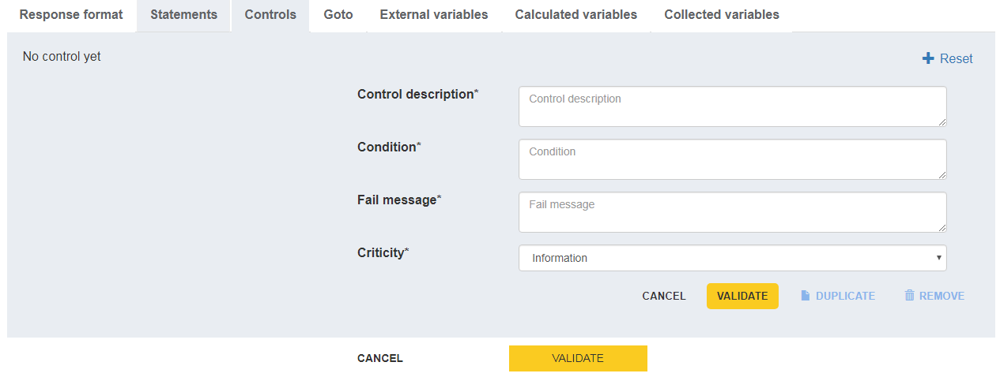

---

# Creation of a control (3)

Fill in :
- control description : free description of the control (for your successor ;-)
- Condition (for which questionnaire will display the fail message) : collected variables are referenced by using the dollar character \$, as you fill in following characters, pogues will propose to autocomplete your entry with the collected variables of the questionnaire containing these characters and then suffix automatically their id with the character \$. example : for the condition the female workforce (for which we can imagine the collected variable with the id WF_F) is strictly greater than the total workforce of the enterprise (for which we can imagine WF_TOTAL), fill in the condition : \$WF_F$ > \$WF_TOTAL$. 

---

# Syntax for conditions (1)
Separe variable id (\$VAR\$) from operators or logical connectors with espaces.
Exemple : \$WF_F$ >= \$WF_TOTAL$

The decimal separator is character : .
'' : empty for a qualitative or a numeric variable
Value 1 : write '1' if the variable is qualitative (code list), 1 if the variable is numeric
Exemple : \$SEX$ = '1' but \$WORKFORCE$ = 1

---

# Syntax for conditions (dates)

 - compare a date to an empty value : string(\$DATECOL\$) = '' 
 - compare a date with other ones (always compare before that the date is not empty) : 
 string(\$DATECOL\$) != '' and (\$DATECOL$ < xs:date(concat(\$ANNEEDAAAA\$,'-06-01')) or \$DATECOL\$ > xs:date(concat(\$ANNEESUIV\$,'-05-31')))

---
# Syntax for conditions (2)

\+ : Addition
\-  : Substraction
\* : Multiplication
= : equal to
!= : different from
< :  lower than (<= : lower or equal to )
\> : greater than (\>= : greater or equal to)
and : and
or : or
div : division with floating point
mod : remainder of the division with floating point
sum($VAR$)=sum of a collected variable inside a dynamic table
Write and, or, etc. in lowercase

---

# Creation of a control (4)
In the "Controls" tab, fill in :
- Fail message : fill in here the fail message displayed to the respondent if the condition above is satisfied
- Criticity : (like the statement type, there's no difference now for the questionnaire or the respondent, therefore choose the most appropriate one without refining)
	- Information
	- Warning
	- Error
- Validate

NB : you can also delete or duplicate a control

---

# Creation of a Goto (or filter) (1)

In the "Goto" tab of the question on which you want to apply a filter, fill in :
- Goto description : this text will be displayed on the pdf paper questionnaire

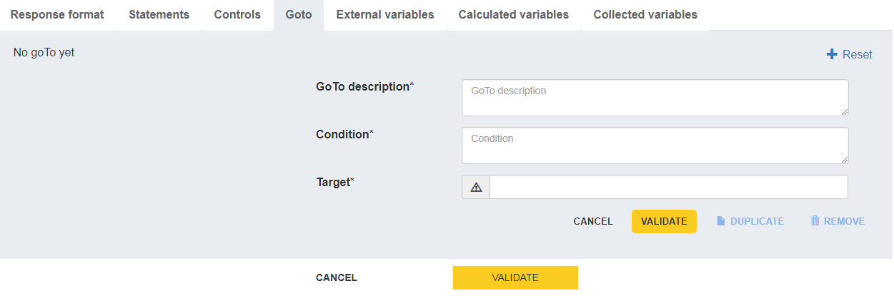

---

# Creation of a Goto (or filter) (2)

Fill in :
- Condition : (for which the respondent will go to a further target question and not to the immediate following question) : collected variables are referenced by using the dollar character \$, as you fill in following characters, pogues will propose to autocomplete your entry with the collected variables of the questionnaire containing these characters and then suffix automatically their id with the character \$.  example : if you go from the question Q1 (yes '1', no '2') to the question Q10 if Q1 ='2' fill in \$Q2\$='2' or \$Q2$ != '1' if you want to filter non response also. 
- Target : Target question of the filter. example : Q10 or S2 or QUESTIONNAIRE_END to reach the end of the questionnaire

---

# Creation of a Goto (or filter) (3)

NB : you can also delete or duplicate a Goto

---

# Creation of an external variable (1)

An external variable refers to a variable that is not collected in the questionnaire but is useful for customizing it. It can be a variable collected previously and recalled for consistency with past responses (last known turnover, last known headcount) or a variable useful for customizing some elements of the questionnaire (collection wave number to filter questions, date or geographical zoning to be displayed in a question label (year or regions for example) etc.). They are defined via the "External variables" tab of any question in the questionnaire.
- Inform:
  - Label
  - Id : see the one in the customization file
  - Response type : from Text, Date, Number, Boolean
- Validate

---

# Creation of an external variable (2)

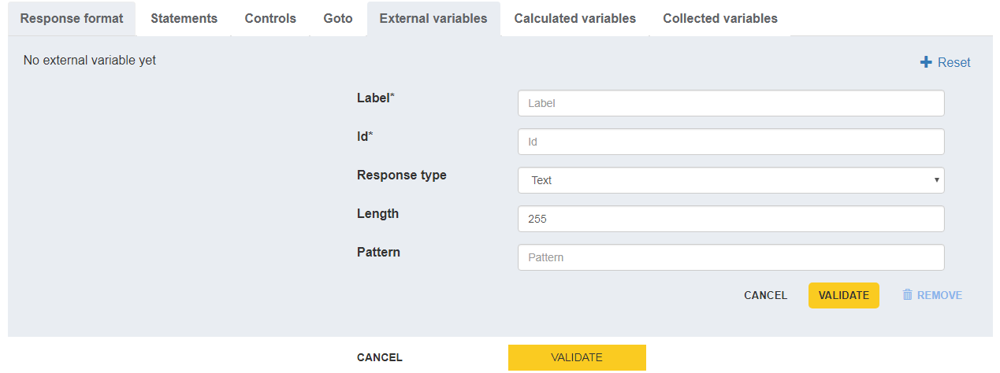

---

# Creation of a calculated variable (1)

It may be necessary to calculate variables from other variables in the questionnaire for some controls in particular.
A calculated variable is defined via the "Calculated Variables" tab of any question in the questionnaire.

---

# Creation of a calculated variable (2)

Fill in 
- Label
- Id
- Formula : you can use : if, then, else if, else 
	- Example : sum of percentages collected in  a table
- Reponse type : among Text, Date, Number, Boolean (see Creation for a simple response question)

Validate

---
# Example : 
Count the number of ticked modalities for the variable REN
(REN has got 7 boolean modalities identified REN1 to REN7)

number(if (\$REN1\$='') then '0' else \$REN1\$) + 
number(if (\$REN2\$='') then '0' else \$REN2\$) +
number(if (\$REN3\$='') then '0' else \$REN3\$) +
number(if (\$REN4\$='') then '0' else \$REN4\$) +
number(if (\$REN5\$='') then '0' else \$REN5\$) +
number(if (\$REN6\$='') then '0' else \$REN6\$) +
number(if (\$REN7\$='') then '0' else \$REN7\$)

---
# Example : 
customize the wording of a question :

if (\$LOGEMENT\$='1') then 'de l''appartement'
else if (\$LOGEMENT\$='2') then 'de la maison'
else 'de votre logement'

NB: to put a single quote in a heading, you must enter two single quotes instead of only one

---
# Example : 
Calculate the exact age at the collection date knowing the date of birth DATEBIRTH :
Report the calculated variables
Current day and month DDMMMCURRENT=number(concat(concat(substring(string(current-date()),6,2)),substring(string(current-date()),9,2)))
Day and month of birth DDMMBIRTH=number(concat(concat(substring(\$DATEBIRTH\$),6,2),substring(\$DATEBIRTH\$),9,2))
Current year CURRENTYEAR=number(substring(string(current-date()),1,4)) 
Year of birth YEARBIRTH=number(substring(\$DATEBIRTH\$),1,4)) 

---
# Example (continued) : 

The exact age at the date of collection is given by :
if ( \$DDMMCURRENT\$ >= \$DDMMBIRTH$ and \$CURRENTYEAR\$ > \$YEARBIRTH\$) then \$CURRENTYEAR\$-\$YEARBIRTH\$
else if (\$DDMMCURRENT\$ < \$DDMMBIRTH\$ and \$CURRENTYEAR\$ > \$YEARBIRTH\$) then \$CURRENTYEAR\$-\$YEARBIRTH\$-1
else 0
The age in difference of vintage will be given by the formula : \$CURRENTYEAR\$-\$YEARBIRTH\$

---
# Style : Bold or Italic

You can put some words in bold or italic with the buttons surrounded in red in the screenshot below

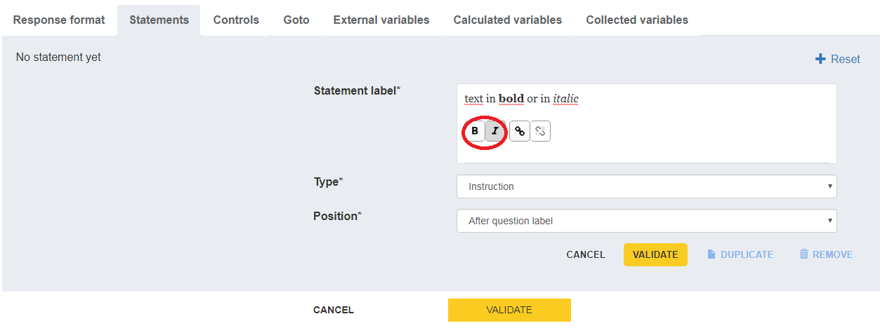

---

# Functionalities related to a questionnaire element
On each created element of the sequence/sub-sequence or question type questionnaire, there are the "Show the detail", "Visualise" (Web,PDF,Specification or DDI) and "Delete" buttons.
On a question, there is also the "Duplicate" button.

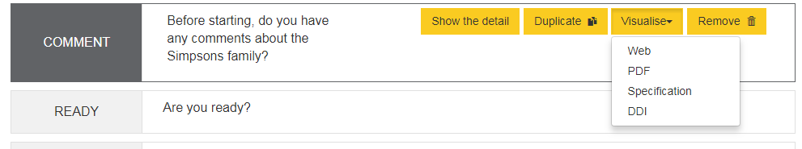

---

"Show the detail" allows you to view the element and modify it if necessary.
"Visualise" allows you to view only the element you are on.
"Delete" allows you to delete an item.
"Duplicate" is used to copy a question. Don't forget to modify the identifier of the duplicate question and the identifier of the collected variable(s) associated with the duplicate, as you can't have the same id for several questions or several collected variables. It is currently not possible to duplicate a code list and keep the original code list and a modified duplicate code list. Any changes to the duplicate code list are currently reflected in the original duplicate code list.

---

# Move elements by drag and drop

It is currently possible to move an element of type sequence, sub-sequence, question by drag and drop. To do this, select the element and drag and drop it to the desired location (even if it means unzooming enough to have on the same screen the question to move and the part of the questionnaire tree where you want to move it).
Be careful, the movement of a sequence or sub-sequence also moves its children (sub-sequences or questions related to it). 
Be careful with the elements moved in case of redirection, the target of a question must not be found before this question.

---

---

# Save or Visualise the questionnaire

It is possible to save or view (Web,PDF,Specification or DDI) the questionnaire at any time (or almost) via the dedicated buttons at the bottom of the page of the Pogues interface. 
The "Publish" button will soon be available, it means to publish/register the questionnaire within the RMéS repository. 
The "Page break" button is currently not working.

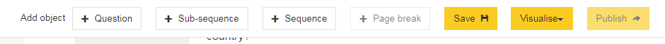

---

# Show the detail or delete the questionnaire

It is possible to "show the detail" of a questionnaire (you can see and perhaps modify informations filled in when creating a questionnaire) or to "delete" it with the dedicated buttons at the top of the page.

---

# Checking the integrity of the questionnaire
The following questionnaire integrity checks are currently being implemented:
- the questionnaire must include at least a sequence and a question
- uniqueness of question, sequence or sub-sequence identifiers
- uniqueness of collected, external or calculated variables identifiers

---
# What is not yet working in Pogues (1)
*manual DDI add-on* 
- The addition of a "Specify" field if a "Other" type modality has been checked
- Fill in a pattern (specify a regular expression) for a text response
- Redirection towards the end of the questionnaire
- Manage units other than €, k€, %, hours, days, months, years
- Loop on the elements of a table (example: individuals aged older than 15 years in a household)
---

- Taking into account multimode (CAWI, CAPI, PAPI, CATI)
*Can be filled in but is not taken into account in the display of the questionnaire*
- The link between Pogues and RMéS and in particular to publish the questionnaire or reuse a question or a code list (e.g. departments, countries, nomenclature) from the repository 
- Condition the label of a question according to the answers previously obtained 
- Duplicate a code list to create a variant
- The "Page break" button at the bottom center of the interface Pogues
- pdf settings (number of columns, portrait or landscape layout, type of entry)
---

choice of numbering type among:
- 1 numbering from 1 to n for all the questions in the questionnaire: this is the most common numbering in the literature, the one found in the insee's household questionnaires in general. It is also the easiest to use when there are filters to describe in a paper questionnaire.
- 1 numbering from 1 to n for each of the questionnaire sequences (1 is repeated for each new sequence): this is the most common numbering in INSEE company surveys.
- no numbering: this is a choice that can be made when there are many filters, and leads to an apparent numbering that can be a little strange. This is the choice of the employment survey in particular.

---
# What we don't yet know how to do in Pogues
- Add totals (fixed at 100% or calculated as the sum of the elements in the column) to a table of collected variables
*manual DDI add-on*
-... 
 
 ---
 # What we won't do in Pogues
 - Specify if the redirection is of type hidden filter (it is by default) or grayed filter
*manual DDI add-on* 

