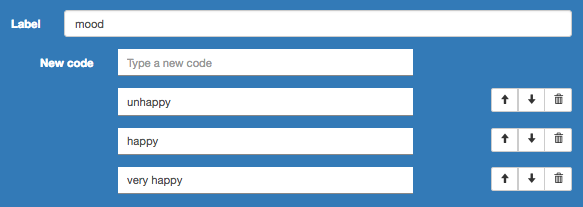

# Utilisation de React et Redux dans Pogues

Cette application utilise [React](https://facebook.github.io/react/) et [Redux](https://github.com/reactjs/redux). React est une librairie `JavaScript` pour construire des interfaces selon un mode déclaratif. Redux est une petite librairie qui fournit des outils pour gérer l'état de l'application (toutes les données manipulées par l'application) et implémente une architecture basée sur un flux de données unidirectionnel.

Les chapitres suivants fournissent de l'information pour les personnes qui ne sont pas utilisatrices de React et Redux. Vous pouvez suivre ce tutoriel sans connaissance préalable de ces technologies. Vous pourrez vous référer utilement aux ressources externes qui seront mentionnées pour obtenir une information plus détaillée.

Si vous utilisez déjà ces technologiees, vous pouvez néanmoins parcourir cette introduction pour découvrir comment React et Redux sont utilisés au sein de Pogues (voir par exemple la section [scinder et associer des reducers](/react-redux/reducers-split-combine.md)).

Nous étudierons la fonction d'édtion d'une liste de codes qui a déjà été implémentée afin d'illustrer le fonctionnement de l'application.

