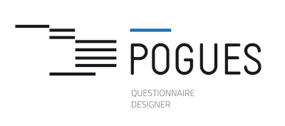

<p align="center">
  
</p>

# Pogues

Navigation: **Website** | [Back-office][1] | [Pogues model][2]

[1]: https://github.com/InseeFr/Pogues-Back-Office
[2]: https://github.com/InseeFr/Pogues-Model

[](https://sonarcloud.io/dashboard?id=inseefr_pogues-next)
[](https://sonarcloud.io/dashboard?id=inseefr_pogues-next)
[](https://sonarcloud.io/dashboard?id=inseefr_pogues-next)
[](https://sonarcloud.io/dashboard?id=inseefr_pogues-next)

## Introduction

Pogues is a tool that allow to design questionnaires with components that are structural (sequences, questions...) and dynamic (filters, controls, loops...).

This is the repository of the front-end part of Pogues.

For more information on how to use the application, a [user documentation](https://inseefr.github.io/Bowie/1._Pogues/) is available (French only).

## Local installation

```bash
pnpm i
pnpm dev
```
